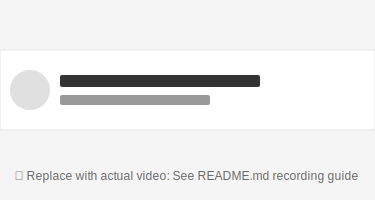

# react-native-fluid-swipe-list

High-performance, fully customizable React Native swipeable list items with native-feeling gestures and animations.

[](https://badge.fury.io/js/react-native-fluid-swipe-list)
[](https://opensource.org/licenses/MIT)

## 📱 Preview



## Features

- **Native-like gestures** - Smooth physics-based animations using Reanimated 3
- **High performance** - 60 FPS animations with worklets
- **Fully customizable** - Custom render items and swipe actions
- **RTL support** - Built-in right-to-left language support
- **TypeScript** - Full type definitions included
- **Accessibility** - Screen reader support
- **FlashList/FlatList** - Works with any list component
- **Imperative API** - Programmatically control swipe state

## Installation

```bash
npm install react-native-fluid-swipe-list
# or
yarn add react-native-fluid-swipe-list
```

### Dependencies

This package requires the following peer dependencies:

```bash
npm install react-native-gesture-handler react-native-reanimated
```

Make sure to follow the [Reanimated installation guide](https://docs.swmansion.com/react-native-reanimated/) and [Gesture Handler installation guide](https://docs.swmansion.com/react-native-gesture-handler/) for proper setup.

## Quick Start

```tsx
import React from 'react';
import { View, Text, StyleSheet, useColorScheme } from 'react-native';
import { SwipeList } from 'react-native-fluid-swipe-list';

const data = [
  { id: '1', title: 'Item 1' },
  { id: '2', title: 'Item 2' },
  { id: '3', title: 'Item 3' },
];

export default function App() {
  const colorScheme = useColorScheme();
  const isDark = colorScheme === 'dark';

  const colors = {
    background: isDark ? '#121212' : '#F5F5F5',
    item: isDark ? '#1E1E1E' : '#FFFFFF',
    text: isDark ? '#FFFFFF' : '#333333',
    border: isDark ? '#333333' : '#E5E5E5',
  };

  return (
    <View style={[styles.container, { backgroundColor: colors.background }]}>
      <SwipeList
        data={data}
        keyExtractor={(item) => item.id}
        renderItem={({ item }) => (
          <View style={[styles.item, { backgroundColor: colors.item, borderBottomColor: colors.border }]}>
            <Text style={[styles.text, { color: colors.text }]}>{item.title}</Text>
          </View>
        )}
        rightActions={(item) => [
          {
            id: 'delete',
            label: 'Delete',
            backgroundColor: isDark ? '#FF453A' : '#FF3B30',
            onPress: (item) => console.log('Delete', item),
          },
        ]}
        leftActions={(item) => [
          {
            id: 'archive',
            label: 'Archive',
            backgroundColor: isDark ? '#30D158' : '#34C759',
            onPress: (item) => console.log('Archive', item),
          },
        ]}
      />
    </View>
  );
}

const styles = StyleSheet.create({
  container: {
    flex: 1,
  },
  item: {
    padding: 20,
    borderBottomWidth: 1,
  },
  text: {
    fontSize: 16,
  },
});
```

## API Reference

### SwipeList Props

| Prop | Type | Default | Description |
|------|------|---------|-------------|
| `data` | `T[]` | required | Array of items to render |
| `renderItem` | `({ item, index }) => ReactElement` | required | Function to render each item |
| `keyExtractor` | `(item, index) => string` | required | Unique key for each item |
| `leftActions` | `(item, index) => SwipeAction[]` | - | Left swipe actions |
| `rightActions` | `(item, index) => SwipeAction[]` | - | Right swipe actions |
| `disableLeftSwipe` | `boolean \| (item, index) => boolean` | `false` | Disable left swipe |
| `disableRightSwipe` | `boolean \| (item, index) => boolean` | `false` | Disable right swipe |
| `swipeThreshold` | `number` | `0.3` | Threshold to trigger open (0-1) |
| `animationDuration` | `number` | `200` | Animation duration in ms |
| `closeOnScroll` | `boolean` | `true` | Close items when scrolling |
| `closeOnPress` | `boolean` | `true` | Close items when pressing |
| `onSwipeOpen` | `(direction, item) => void` | - | Called when item opens |
| `onSwipeClose` | `(item) => void` | - | Called when item closes |
| `ListComponent` | `React.ComponentType` | `FlatList` | Custom list component |
| `listProps` | `object` | - | Props passed to list component |

### SwipeAction

| Property | Type | Description |
|----------|------|-------------|
| `id` | `string` | Unique identifier |
| `label` | `string` | Button label text |
| `backgroundColor` | `string` | Background color |
| `icon` | `ReactNode` | Optional icon component |
| `onPress` | `(item) => void` | Press handler |
| `width` | `number` | Button width (default: 80) |
| `style` | `ViewStyle` | Additional styles |
| `textStyle` | `TextStyle` | Label text styles |

## Advanced Usage

### Dynamic Actions per Item

```tsx
<SwipeList
  data={data}
  keyExtractor={(item) => item.id}
  renderItem={({ item }) => <MessageCard item={item} />}
  leftActions={(item, index) =>
    item.canArchive
      ? [
          {
            id: 'archive',
            label: 'Archive',
            backgroundColor: '#4CAF50',
            onPress: handleArchive,
          },
        ]
      : undefined
  }
  rightActions={(item, index) =>
    item.canDelete
      ? [
          {
            id: 'delete',
            label: 'Delete',
            backgroundColor: '#FF3B30',
            onPress: handleDelete,
          },
        ]
      : undefined
  }
/>
```

### Imperative API

```tsx
import { useRef } from 'react';
import { SwipeList } from 'react-native-fluid-swipe-list';

function App() {
  const listRef = useRef<{ closeAll: () => void }>(null);

  return (
    <>
      <Button title="Close All" onPress={() => listRef.current?.closeAll()} />
      <SwipeList ref={listRef} data={data} {...otherProps} />
    </>
  );
}
```

### Custom SwipeableItem

```tsx
import { SwipeableItem, useSwipeable } from 'react-native-fluid-swipe-list';

function CustomItem({ item }) {
  const { ref, openLeft, close } = useSwipeable();

  return (
    <SwipeableItem
      ref={ref}
      item={item}
      index={0}
      renderItem={({ item }) => <View>...</View>}
      leftActions={[{ id: 'action', label: 'Action', onPress: close }]}
      itemUniqueId={item.id}
    />
  );
}
```

### With FlashList

```tsx
import { FlashList } from '@shopify/flash-list';
import { SwipeList } from 'react-native-fluid-swipe-list';

<SwipeList
  ListComponent={FlashList}
  data={data}
  keyExtractor={(item) => item.id}
  renderItem={({ item }) => <View>...</View>}
  listProps={{ estimatedItemSize: 80 }}
/>
```

## License

MIT